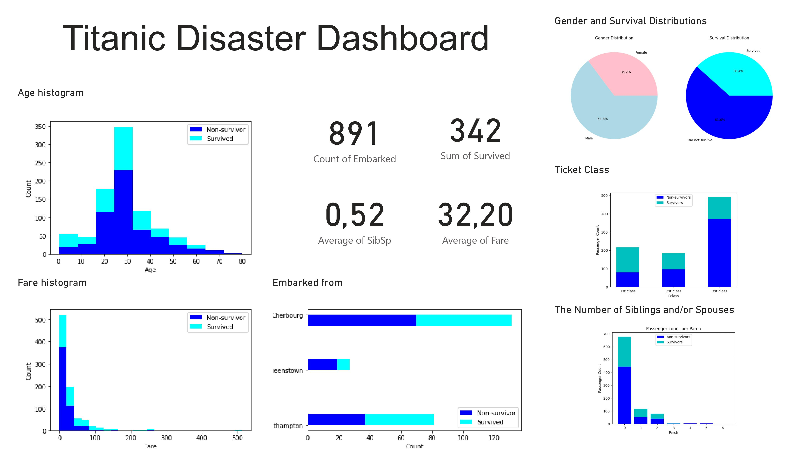

You can see the whole project by going to jupiter notebook file Titanic data analysis.ipynb (.ipynb file). 

In the project I prepared, processed and analyzed the data. At the end of the project I compared different machine learning models and submitted the best performing model to the Kaggle competition. 
